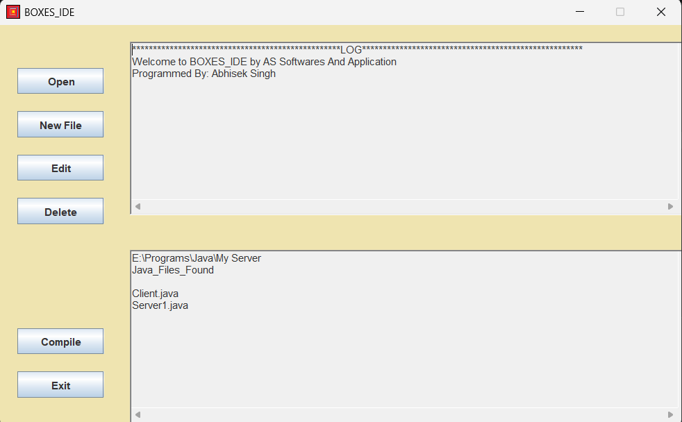
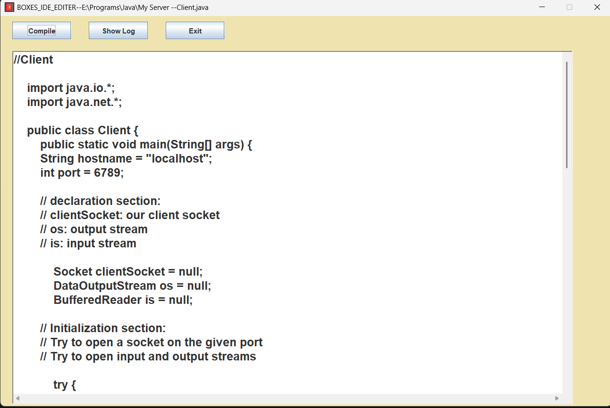
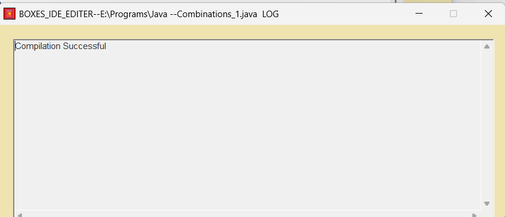
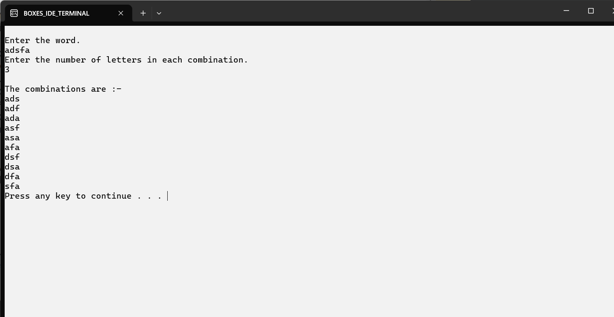

# Boxes IDE

## Overview

This project was completed in Class 9 to understand the working of the NetBeans Integrated Development Environment (IDE) and the Java development workflow.

The original source code has mostly been lost due to hard disk corruption, but I was able to recover and decompile the executable saved in cloud, which is preserved in this repository.

## Learning Outcomes

### Understanding NetBeans IDE

* Explored the features and functionality of the NetBeans IDE.
* Learned how the IDE simplifies Java application development.

### Java Development Kit (JDK) Tools

Studied and understood the purpose and working of the following JDK tools:

* **`javac`** – Compiles Java source code into bytecode (`.class` files).
* **`java`** – Executes compiled Java programs.
* **`javaw`** – Runs Java applications without opening a console window (commonly used for GUI applications).

### Code Formatting Challenges

* Gained experience writing Java code manually.
* Understood the difficulties of maintaining proper code formatting and indentation without automated IDE support.
* Learned the importance of formatting tools and conditional formatting features provided by modern IDEs.

## Screenshots

### Interface

### Editor

### Compilation

### Output

## Conclusion

This project provided a foundational understanding of Java development, JDK tools, and the advantages of using an IDE like NetBeans for coding, compiling, running, and formatting Java applications.
